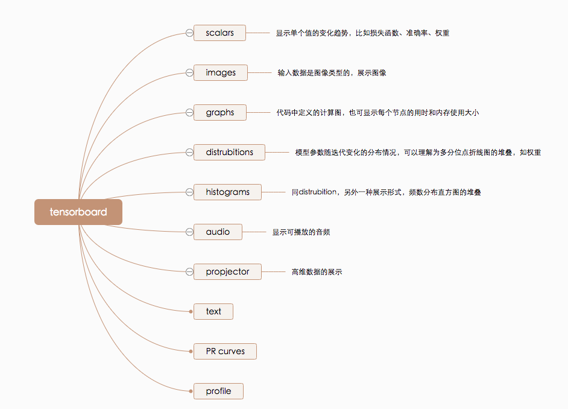
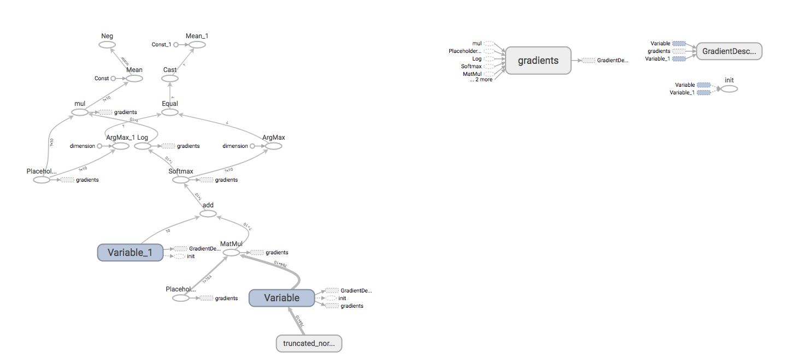
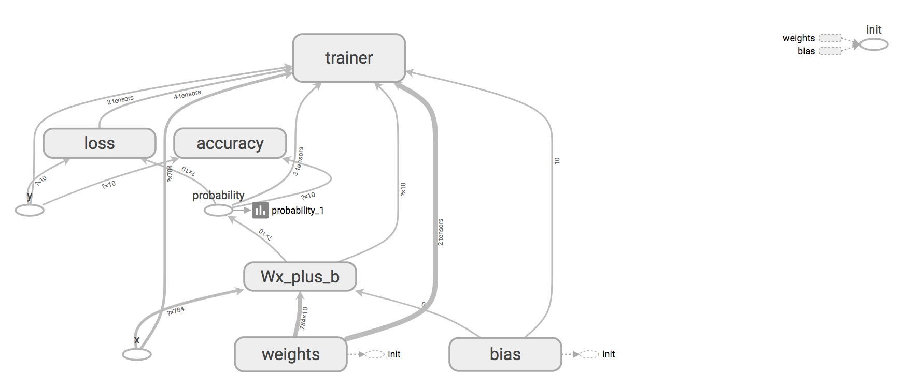

# 逻辑回归分类器

## mnist

mnist手写体识别是一个经典的问题。TensorFlow官方例子中给出的是使用卷积神经网络（CNN）实现识别。此处参照TensorFlow官方例子和[TensorFlow实现逻辑回归分类器](https://blog.csdn.net/diligent_321/article/details/52937400)给出一个使用传统机器学习算法“逻辑回归”实现识别的demo。但是需要说明的是使用“逻辑回归”分类效果实际是不如卷积神经网络的。此处只是为了学习TensorFlow如何实现“逻辑回归”分类算法，以及借助TensorBoard了解逻辑回归算法构建的graph。

实际可以简单的认为“逻辑回归”是一种只有一层的最简单的全联接的神经网络。但是在最基础的神经网络中，图像的像素点对应神经元，随着隐藏层神经元数量的增多，参数的规模也会极具增加，训练效率低，也容易出现过拟合。而图像本身具有部分平移不变性和局部相关性的特点，采用全连接的网络很难提取这些局部不变特征。但是采用卷积神经网络则可以通过局部连接和参数共享，更好的利用图像中内在的拓扑关系及平移不变形，大大减少参数，得到一个更好的局部最优解，使其在图像问题上有更好的性能。

### 代码说明

逻辑回归可以简单的认为是一个y=W·x+b的问题。目标是基于一个最小化指标求解W和b。

mnist原始数据集的每张图片由28 * 28个像素点构成，每个像素点用一个灰度值表示。计算时将28 * 28个像素转换为一个一维的向量。因此每条样本相当于一个维数为784的向量。并且mnist的手写体是0-9十个数字，其label是一个10 * 1的向量，比如0对应的向量是[1,0,0,0,0,0,0,0,0,0]。因此求解的W是一个784 * 10的矩阵，b是一个1 * 10的向量。

TensorBoard 通过读取 TensorFlow 的事件文件来运行。如果希望通过TensorBoard理解、调试、优化TensorFlow，需要在代码中生成汇总数据（Summary data）。TensorBoard各个面板说明：

mnist_without_namescope.py文件只是在实现逻辑回归分类的基础上仅仅汇总了graph，并没有在代码中为变量名划定范围优化可视化效果。其生成的graph难以帮助用户理解构建的计算流程。

mnist_with_namescope.py文件使用namescope添加名称和作用域优化graph的呈现。并且除了计算图以外收集了一些准确率、损失等标量信息绘制scalars面板下的折线图，同时收集了诸如权重等信息绘制distrubitions,histograms面板下的图。

### 参考文档：

[详解 MNIST 数据集](https://blog.csdn.net/simple_the_best/article/details/75267863)

[ImageNet冠军带你入门计算机视觉：卷积神经网络](https://mp.weixin.qq.com/s?__biz=MzU1NDA4NjU2MA==&mid=2247487127&idx=1&sn=30f89932c0e22cfc1c07995d41fc0b34&chksm=fbe9b758cc9e3e4eb0723ba747aa8087e80454175c46568d7f6ad2858f8e5a365e96f9b51c3e&scene=0&key=488598e887e7880d6ba61a5fff02116fdd52594c0b44a3a91e793fade588d4deeb4020b342a50b53d1d9a242faf93f59205965cd4d67359b5b2881120992ffb52494caca2a04724ec7f99c025f21e61e&ascene=0&uin=MjM0OTM3NDc4MA%3D%3D&devicetype=iMac+MacBookPro14%2C1+OSX+OSX+10.12.5+build(16F2073)&version=12020810&nettype=WIFI&fontScale=100&pass_ticket=tlai%2Bhw8iyY0bx9A1QCQqL6P1GA0UE7DXe49hEOEUtIpoEMA5tpWS66mawBEm0jj)

[卷积神经网络](https://nndl.github.io/chap-%E5%8D%B7%E7%A7%AF%E7%A5%9E%E7%BB%8F%E7%BD%91%E7%BB%9C.pdf)

[TensorBoard:可视化学习](http://wiki.jikexueyuan.com/project/tensorflow-zh/how_tos/summaries_and_tensorboard.html)

[TensorBoard:图表可视化](http://wiki.jikexueyuan.com/project/tensorflow-zh/how_tos/graph_viz.html)

[TENSORFLOW - TENSORBOARD可视化](https://gaussic.github.io/2017/08/16/tensorflow-tensorboard/)
